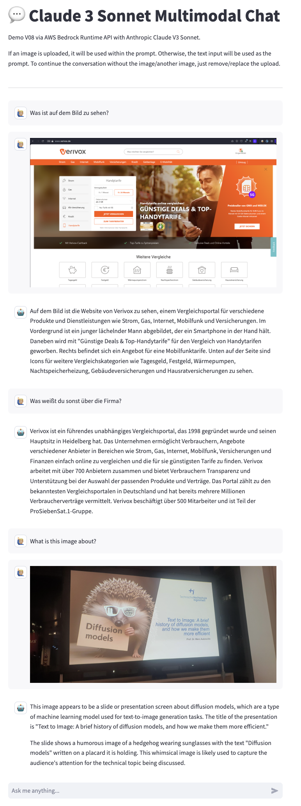

# Multimodal Chat Demo of Anthropic Claude Sonnet V3 via AWS Bedrock

This repository contains a Streamlit application that demonstrates the capabilities of Anthropic's Claude Sonnet V3 model via the AWS Bedrock API. The app supports multimodal interactions, allowing users to engage in a conversation with the model using both text and images.
The focus of this application is to serve as a feasability demonstration and a possible starting point for others to develop it further/ build on it/improve code quality etc.   




## Features

- **Text-based Interaction:** Users can input text questions or statements for the model to respond to.
- **Image-based Interaction:** Users have the option to upload an image, which the model will consider as part of the conversation context.
- **Conversation History:** The app maintains a history of the conversation, displaying previous exchanges between the user and the model.


## Setup

To run this app, follow these steps:

1. **Clone the Repository**

   ```bash
   git clone <repository-url>
   ```

2. **Install Dependencies**

   Navigate to the cloned repository's directory and install the required Python packages.

   ```bash
   pip install -r requirements.txt
   ```

3. **Configuration**

   Create a `secrets.toml` file in the root directory of your project with the following structure:

   ```toml
   [bedrock]
   aws_access_key_id = "YourAWSAccessKeyID"
   aws_secret_access_key = "YourAWSSecretAccessKey"
   region_name = "YourAWSRegion"
   ```

   Replace the placeholders with your actual AWS credentials and region.

4. **Run the App**

   Launch the app by running:

   ```bash
   streamlit run app.py
   ```

   Navigate to the URL provided by Streamlit to view the app.

## How It Works

The app uses the AWS Bedrock API to communicate with the Anthropic Claude V3 Sonnet model. Users can input text or upload images, which are then sent to the model as part of the conversation history. The model processes these inputs and generates a response, which is displayed in the app.

The code in `app.py` demonstrates how to set up the Streamlit app, handle user inputs, and communicate with the AWS Bedrock API.

## Requirements

- Python 3.8+
- Streamlit
- Boto3
- TOML
- Pillow

Please ensure you have these installed before running the app.

## Contributing

I welcome contributions to improve this demo app. Please feel free to submit pull requests or open issues to suggest enhancements or report bugs.

## License

This project is licensed under the MIT License. See the LICENSE file for more details.
